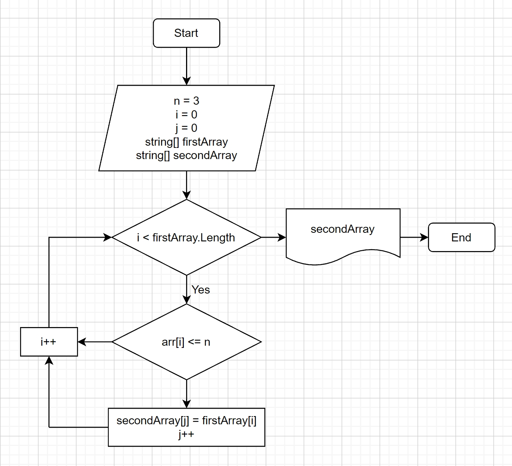

# Итоговая работа

## Задача:
Написать программу, которая из имеющегося массива строк формирует новый массив из строк, длина которых меньше, либо равна трём символам.

Первоначальный массив можно ввести клавиатуры, либо задать на старте выполнения алгоритма. При решении не рекомендуется пользоваться коллекциями, лучше обойтись исключительно массивами.

**Примеры:** *["Hello", "2", "world", ":-)"]*

## Алгоритм решения:

1. Создаём строковый массив.
2. Создаём метод *FillArray*, заполняющий массив значениями введёнными пользователем.
3. Создаём метод *PrintArray* вывода заполненного массива поэлементно на экран.
4. Создаём метод *GetSizeOfSecondArray*, определяющий размер нового массива.
5. Создаём условие окончания решения, если размер второго массива равен нулю.
6. Создаём метод *TransferElements*, переносящий определённые по условию задания элементы из первичного массива в новый.
7. Вывод на экран заполненного второго массива.

## Дополнительно:
Добавлена блок-схема алгоритма решения задачи.
